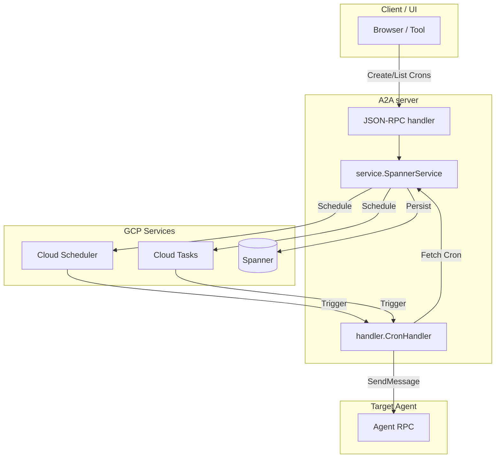

# A2A SCHEDULER GO SDK

[](LICENSE)

This project contains a lightweight Go library for developers supporting the [a2a-scheduler](spec.md) A2A extension.

## Features

- **Integration with the official [A2A Go SDK](https://github.com/a2aproject/a2a-go/tree/main):** Builds on top of the official library for building A2A-compliant agents in Go.
- **Built-in persistence:** Includes a Google Cloud Spanner-backed [`service.SpannerService`](service/spanner.go) which leverages Google Cloud Scheduler and Cloud Tasks for execution.
- **Agent Extension support:** An [`a2asrv.AgentExtension`](a2asrv/extension.go) to advertise support for the scheduler extension.
- **HTTP handler:** A [`handler`](handler/) for receiving and processing scheduled task executions from Cloud Scheduler or Cloud Tasks.
- **JSON-RPC handler:** A [`jsonrpc`](jsonrpc/) HTTP handler for managing crons from clients.

## Packages

| Package                                                     | Role                                                                                                                                                                                                                                                                                         |
| ----------------------------------------------------------- | -------------------------------------------------------------------------------------------------------------------------------------------------------------------------------------------------------------------------------------------------------------------------------------------- |
| [`go.alis.build/a2a/extension/scheduler/service`](service/) | [`SpannerService`](service/spanner.go), [`NewSpannerService`](service/spanner.go), and [`(*SpannerService).Register`](service/spanner.go) for the built-in Google Cloud Spanner + IAM implementation and gRPC registration.                                                             |
| [`go.alis.build/a2a/extension/scheduler/a2asrv`](a2asrv/)   | [`AgentExtension`](a2asrv/extension.go) ([`a2a.AgentExtension`](https://pkg.go.dev/github.com/a2aproject/a2a-go/v2/a2a#AgentExtension)) for advertising extension support.                                                                                                                    |
| [`go.alis.build/a2a/extension/scheduler/handler`](handler/) | [`NewCronHandler`](handler/handler.go) for the core execution handler, plus [`Register`](handler/register.go) as a convenience helper for mounting it at [`SchedulerExtensionHandlerPath`](handler/handler.go). Defaults to the local agent gRPC target and supports override options. |
| [`go.alis.build/a2a/extension/scheduler/jsonrpc`](jsonrpc/) | [`Register`](jsonrpc/register.go), [`NewJSONRPCHandler`](jsonrpc/jsonrpc.go), and options such as [`WithCORS`](jsonrpc/cors.go), plus JSON-RPC error mapping ([`errors.go`](jsonrpc/errors.go)).                                                                                           |

Package-level documentation (design, IAM roles, execution flow) lives in [`service/docs.go`](service/docs.go), [`a2asrv/docs.go`](a2asrv/docs.go), [`handler/docs.go`](handler/docs.go), and [`jsonrpc/docs.go`](jsonrpc/docs.go). Run `go doc -all ./...` locally for the full commentary.

## Architecture (high level)



1. **Management path:** Clients use the JSON-RPC handler to manage `Cron` resources. `SpannerService` persists these in Spanner and synchronizes them with Google Cloud Scheduler (for recurring tasks) or Google Cloud Tasks (for one-time tasks).
2. **Execution path:** When a scheduled time is reached, Cloud Scheduler or Cloud Tasks sends a POST request to the `CronHandler`. The handler verifies the request, retrieves the cron details from the service, and invokes the target agent with the configured prompt using the A2A protocol.

## Installation

```bash
go get -u go.alis.build/a2a/extension/scheduler
```

## Getting started

### Scheduler service

Use the built-in Spanner-backed `SpannerService`:

```go
import (
	"go.alis.build/a2a/extension/scheduler/service"
)

schedulerService, err := service.NewSpannerService(ctx, &service.SpannerServiceConfig{
	SpannerProject:    "SPANNER_PROJECT_ID",
	SchedulingProject: "SCHEDULING_PROJECT_ID",
	SchedulingQueue:   "CLOUD_TASKS_QUEUE_NAME",
	SchedulingRegion:  "GCP_REGION",
	Instance:          "SPANNER_INSTANCE_ID",
	Database:          "SPANNER_DATABASE_ID",
	CronTable:         "CRONS_TABLE_NAME",
	ServiceAccount:    "triggering-sa@project.iam.gserviceaccount.com",
	Audience:          "https://your-agent-endpoint.com",
	TargetUrl:         "https://your-agent-endpoint.com/alis.a2a.extension.v1.SchedulerService/handler",
})
```

Register it on your gRPC server without importing the generated scheduler proto package:

```go
grpcServer := grpc.NewServer()
schedulerService.Register(grpcServer)
```

We suggest that you keep the scheduler resources in a dedicated extension module at:

```text
infra/
  main.tf
  apis.tf
  extensions/
    alis.a2a.extension.scheduler.v1/
      main.tf
```

The root module wires the scheduler extension like this:

```hcl
module "alis_a2a_extension_scheduler_v1" {
  source = "./extensions/alis.a2a.extension.scheduler.v1"

  alis_os_project               = var.ALIS_OS_PROJECT
  alis_region                   = var.ALIS_REGION
  alis_managed_spanner_project  = var.ALIS_MANAGED_SPANNER_PROJECT
  alis_managed_spanner_instance = var.ALIS_MANAGED_SPANNER_INSTANCE
  alis_managed_spanner_db       = var.ALIS_MANAGED_SPANNER_DB
  agent_service_name            = google_cloud_run_v2_service.agent.name
  neuron                        = local.neuron

  depends_on = [google_project_service.environment]
}
```

Inside `extensions/alis.a2a.extension.scheduler.v1/main.tf`, provision the Cloud Run invoker binding, Cloud Tasks queue, and Spanner table aligned with `SpannerService` expectations:

```hcl
resource "google_cloud_run_service_iam_member" "scheduler_invoker" {
  service  = var.agent_service_name
  location = var.alis_region
  role     = "roles/run.invoker"
  member   = "serviceAccount:alis-build@${var.alis_os_project}.iam.gserviceaccount.com"
}

resource "google_cloud_tasks_queue" "scheduler" {
  name     = "${var.neuron}-scheduler-v1"
  location = var.alis_region
}

resource "alis_google_spanner_table" "crons" {
  project         = var.alis_managed_spanner_project
  instance        = var.alis_managed_spanner_instance
  database        = var.alis_managed_spanner_db
  name            = "${replace(var.alis_os_project, "-", "_")}_${replace(var.neuron, "-", "_")}_Crons"
  prevent_destroy = false

  schema = {
    columns = [
      {
        name           = "key"
        type           = "STRING"
        is_primary_key = true
        required       = true
      },
      {
        name          = "Cron"
        type          = "PROTO"
        proto_package = "alis.a2a.extension.scheduler.v1.Cron"
        required      = true
      },
      {
        name          = "Policy"
        type          = "PROTO"
        proto_package = "google.iam.v1.Policy"
        required      = false
      },
      {
        name            = "create_time"
        type            = "TIMESTAMP"
        required        = false
        is_computed     = true
        computation_ddl = "TIMESTAMP_ADD(TIMESTAMP_SECONDS(Cron.create_time.seconds), INTERVAL CAST(FLOOR(Cron.create_time.nanos / 1000) AS INT64) MICROSECOND)"
        is_stored       = true
      },
      {
        name            = "update_time"
        type            = "TIMESTAMP"
        required        = false
        is_computed     = true
        computation_ddl = "TIMESTAMP_ADD(TIMESTAMP_SECONDS(Cron.update_time.seconds), INTERVAL CAST(FLOOR(Cron.update_time.nanos / 1000) AS INT64) MICROSECOND)"
        is_stored       = true
      },
    ]
  }
}
```

### Advertising the extension on the Agent Card

Advertise support for the scheduler extension in your Agent Card:

```go
import (
	"github.com/a2aproject/a2a-go/v2/a2a"
	schedulera2asrv "go.alis.build/a2a/extension/scheduler/a2asrv"
)

// Define the Agent Card
agentCard := a2a.AgentCard{
    Capabilities: a2a.AgentCapabilities{
        Extensions: []a2a.AgentExtension{
            schedulera2asrv.AgentExtension,
        },
    },
}
```

### JSON-RPC handler (optional)

Expose scheduler management over HTTP with [`jsonrpc.NewJSONRPCHandler`](jsonrpc/jsonrpc.go). The handler accepts optional functional options (`...jsonrpc.JSONRPCHandlerOption`). Mount it at [`jsonrpc.SchedulerJsonRpcExtensionPath`](jsonrpc/jsonrpc.go) or any path your gateway uses. Wire format: JSON-RPC 2.0 with protobuf messages in `params` / `result` via **protojson**; service errors that are gRPC statuses are translated to JSON-RPC errors (see [`jsonrpc/errors.go`](jsonrpc/errors.go) for codes such as [`ErrNotFound`](jsonrpc/errors.go), [`ErrInvalidParams`](jsonrpc/errors.go)).

Same-origin or non-browser clients (no CORS):

```go
import "go.alis.build/a2a/extension/scheduler/jsonrpc"

mux.Handle(jsonrpc.SchedulerJsonRpcExtensionPath, jsonrpc.NewJSONRPCHandler(schedulerService))
```

If you use a method-aware mux such as Go 1.22+ `http.ServeMux`, you can let the package mount the
scheduler endpoint for you:

```go
jsonrpc.Register(mux, schedulerService)
```

Browser clients crossing origins need CORS on the JSON-RPC responses and an OPTIONS preflight. Pass [`jsonrpc.WithCORS`](jsonrpc/cors.go):

```go
jsonrpc.Register(mux, schedulerService, jsonrpc.WithCORS())
```

### Cron execution handler

Mount the cron execution handler for Cloud Scheduler or Cloud Tasks callbacks:

```go
import (
	schedulerhandler "go.alis.build/a2a/extension/scheduler/handler"
)

// Cron handler for triggered executions (e.g. target URL points here)
schedulerhandler.Register(mux, schedulerService)
```

If the cron handler must invoke a different agent endpoint, override the default gRPC target:

```go
schedulerhandler.Register(
	mux,
	schedulerService,
	schedulerhandler.WithAgentTarget("example.internal:8443"),
)
```

## Documentation

- See [`service/docs.go`](service/docs.go), [`handler/docs.go`](handler/docs.go), and [`jsonrpc/docs.go`](jsonrpc/docs.go) for detailed method-level flows and IAM roles.
- [Proto definitions](https://github.com/alis-exchange/common-protos/blob/main/alis/a2a/extension/scheduler/v1/scheduler.proto)
- [Generated Go Protobufs](https://github.com/alis-exchange/common-go/tree/main/alis/a2a/extension/scheduler/v1)
