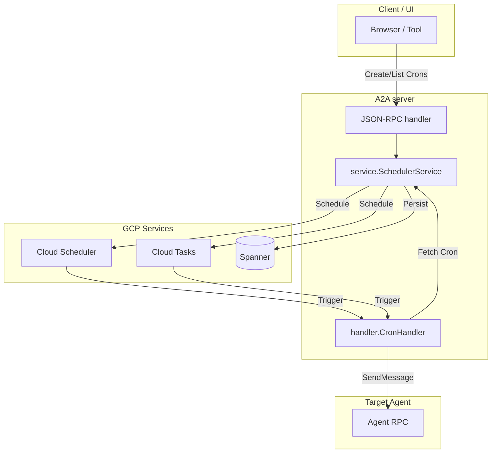

# A2A SCHEDULER GO SDK

[](LICENSE)



This project contains a lightweight Go library for developers supporting the [a2a-scheduler](spec.md) A2A extension.

## Features

- **Integration with the official [A2A Go SDK](https://github.com/a2aproject/a2a-go/tree/main):** Builds on top of the official library for building A2A-compliant agents in Go.
- **Built-in persistence:** Includes a Google Cloud Spanner-backed [`service.SchedulerService`](service/spanner.go) which leverages Google Cloud Scheduler and Cloud Tasks for execution.
- **Agent Extension support:** An [`a2asrv.AgentExtension`](a2asrv/extension.go) to advertise support for the scheduler extension.
- **HTTP handler:** A [`handler`](handler/) for receiving and processing scheduled task executions from Cloud Scheduler or Cloud Tasks.
- **JSON-RPC handler:** A [`jsonrpc`](jsonrpc/) HTTP handler for managing crons from clients.

## Packages

| Package                                                     | Role                                                                                                                                                                                                                                                                                   |
| ----------------------------------------------------------- | -------------------------------------------------------------------------------------------------------------------------------------------------------------------------------------------------------------------------------------------------------------------------------------- |
| [`go.alis.build/a2a/extension/scheduler/service`](service/) | [`SchedulerService`](service/spanner.go), [`NewSchedulerService`](service/spanner.go), [`(*SchedulerService).RegisterGRPC`](service/register.go), and [`service.UnaryServerInterceptor`](service/register.go) for the built-in Google Cloud Spanner + IAM implementation and gRPC wiring. |
| [`go.alis.build/a2a/extension/scheduler/a2asrv`](a2asrv/)   | [`AgentExtension`](a2asrv/extension.go) ([`a2a.AgentExtension`](https://pkg.go.dev/github.com/a2aproject/a2a-go/v2/a2a#AgentExtension)) for advertising extension support.                                                                                                             |
| [`go.alis.build/a2a/extension/scheduler/handler`](handler/) | [`NewCronHandler`](handler/handler.go) for the core execution handler, plus [`Register`](handler/register.go) as a convenience helper for mounting it at [`HandlerPath`](handler/register.go). Defaults to the local agent gRPC target and supports override options.                |
| [`go.alis.build/a2a/extension/scheduler/jsonrpc`](jsonrpc/) | [`Register`](jsonrpc/register.go), [`NewJSONRPCHandler`](jsonrpc/jsonrpc.go), and options such as [`WithCORS`](jsonrpc/cors.go), plus JSON-RPC error mapping ([`errors.go`](jsonrpc/errors.go)).                                                                                       |

Package-level documentation (design, IAM roles, execution flow) lives in [`service/docs.go`](service/docs.go), [`a2asrv/docs.go`](a2asrv/docs.go), [`handler/docs.go`](handler/docs.go), and [`jsonrpc/docs.go`](jsonrpc/docs.go). Run `go doc -all ./...` locally for the full commentary.

## Architecture (high level)



1. **Management path:** Clients use the JSON-RPC handler to manage `Cron` resources. `SchedulerService` persists these in Spanner and synchronizes them with Google Cloud Scheduler (for recurring tasks) or Google Cloud Tasks (for one-time tasks).
2. **Execution path:** When a scheduled time is reached, Cloud Scheduler or Cloud Tasks sends a POST request to the `CronHandler`. The handler verifies the request, retrieves the cron details from the service, and invokes the target agent with the configured prompt using the A2A protocol.

## Installation

```bash
go get -u go.alis.build/a2a/extension/scheduler
```

## Intentional setup flow

Treat the scheduler extension as five deliberate steps inside your agent:

1. **Provision the scheduler backing resources** your agent will depend on.
2. **Instantiate `service.SchedulerService`** with values that exactly match those resources.
3. **Mount the HTTP surfaces** for management and execution.
4. **Advertise the extension** on your Agent Card so clients know it exists.
5. **Verify the contract** between infrastructure, handler URLs, and agent target before shipping.

The important design constraint is that the infrastructure names and URLs are not incidental. `SchedulerService` creates Cloud Scheduler jobs and Cloud Tasks tasks that call back into your agent, so the values in Terraform and `SchedulerServiceConfig` must line up exactly.

## Getting started

### Step 1: Provision the backing resources first

Before you write any application wiring, decide where the extension state and execution resources live:

- **Spanner** stores the `Cron` records and IAM policy.
- **Cloud Scheduler** executes recurring schedules.
- **Cloud Tasks** executes one-time schedules.
- **Cloud Run / HTTP endpoint** receives scheduler callbacks at the cron handler path.
- **Service account + audience** are used to mint the OIDC token attached to each scheduled callback.

The `alis.build/alis/build/ge/agent/v2/infra` setup keeps the scheduler resources in a dedicated module, alongside the other agent persistence modules:

```text
infra/
  main.tf
  apis.tf
  cloudrun.tf
  spanner.tf
  storage.tf
  variables.tf
  modules/
    alis.adk.sessions.v1/
      main.tf
    alis.a2a.extension.history.v1/
      main.tf
    alis.a2a.extension.scheduler.v1/
      main.tf
```

`infra/main.tf` wires the scheduler module like this:

```hcl
module "alis_a2a_extension_scheduler_v1" {
  source = "./modules/alis.a2a.extension.scheduler.v1"

  alis_os_project               = var.ALIS_OS_PROJECT
  alis_region                   = var.ALIS_REGION
  alis_managed_spanner_project  = var.ALIS_MANAGED_SPANNER_PROJECT
  alis_managed_spanner_instance = var.ALIS_MANAGED_SPANNER_INSTANCE
  alis_managed_spanner_db       = var.ALIS_MANAGED_SPANNER_DB
  agent_service_name            = google_cloud_run_v2_service.agent.name
  neuron                        = local.neuron

  depends_on = [google_project_service.environment]
}
```

That root infra also establishes the rest of the scheduler runtime contract:

- `apis.tf` enables `aiplatform.googleapis.com`, `cloudscheduler.googleapis.com`, and `cloudtasks.googleapis.com`.
- `cloudrun.tf` deploys the agent service as `agent-v2` and runs it as `alis-build@${var.ALIS_OS_PROJECT}.iam.gserviceaccount.com`.
- `variables.tf` derives `local.neuron = "agent-v2"` and defaults `local.agent_service_url` to `https://agent-v2-${var.ALIS_PROJECT_NR}.${var.ALIS_REGION}.run.app`.

Inside `modules/alis.a2a.extension.scheduler.v1/main.tf`, the scheduler-specific resources aligned with `SchedulerService` are:

```hcl
resource "google_cloud_run_service_iam_member" "scheduler_invoker" {
  service  = var.agent_service_name
  location = var.alis_region
  role     = "roles/run.invoker"
  member   = "serviceAccount:alis-build@${var.alis_os_project}.iam.gserviceaccount.com"
}

resource "google_cloud_tasks_queue" "scheduler" {
  name     = "${var.neuron}-a2a-scheduler"
  location = var.alis_region
}

resource "alis_google_spanner_table" "crons" {
  project         = var.alis_managed_spanner_project
  instance        = var.alis_managed_spanner_instance
  database        = var.alis_managed_spanner_db
  name            = "${replace(var.alis_os_project, "-", "_")}_${replace(var.neuron, "-", "_")}_Crons"
  prevent_destroy = false

  schema = {
    columns = [
      {
        name           = "key"
        type           = "STRING"
        is_primary_key = true
        required       = true
      },
      {
        name          = "Cron"
        type          = "PROTO"
        proto_package = "alis.a2a.extension.scheduler.v1.Cron"
        required      = true
      },
      {
        name          = "Policy"
        type          = "PROTO"
        proto_package = "google.iam.v1.Policy"
        required      = false
      },
      {
        name            = "create_time"
        type            = "TIMESTAMP"
        required        = false
        is_computed     = true
        computation_ddl = "TIMESTAMP_ADD(TIMESTAMP_SECONDS(Cron.create_time.seconds), INTERVAL CAST(FLOOR(Cron.create_time.nanos / 1000) AS INT64) MICROSECOND)"
        is_stored       = true
      },
      {
        name            = "update_time"
        type            = "TIMESTAMP"
        required        = false
        is_computed     = true
        computation_ddl = "TIMESTAMP_ADD(TIMESTAMP_SECONDS(Cron.update_time.seconds), INTERVAL CAST(FLOOR(Cron.update_time.nanos / 1000) AS INT64) MICROSECOND)"
        is_stored       = true
      },
    ]
  }
}
```

Two details are easy to miss:

- This module does not provision Cloud Scheduler jobs up front. `SchedulerService.CreateCron` creates those jobs dynamically at runtime in the project and region you pass in.
- The Cloud Run invoker grant is for the same `alis-build@...` service account that the deployed service uses, so that identity can both schedule and call the cron handler.

At the end of this step, you should know these concrete values:

| Value                                    | Why it matters                                                                                                                 |
| ---------------------------------------- | ------------------------------------------------------------------------------------------------------------------------------ |
| `SpannerProject`, `Instance`, `Database` | In this infra, these come from `ALIS_MANAGED_SPANNER_PROJECT`, `ALIS_MANAGED_SPANNER_INSTANCE`, and `ALIS_MANAGED_SPANNER_DB`. |
| `TablePrefix`                            | `${replace(ALIS_OS_PROJECT, "-", "_")}_${replace("agent-v2", "-", "_")}`                                                        |
| `SchedulingProject`, `SchedulingRegion`  | In this infra, `ALIS_OS_PROJECT` and `ALIS_REGION`.                                                                            |
| `SchedulingQueue`                        | `agent-v2-a2a-scheduler`                                                                                                       |
| `ServiceAccount`                         | `alis-build@${ALIS_OS_PROJECT}.iam.gserviceaccount.com`                                                                        |
| `Audience`                               | The deployed agent base URL, which in this infra resolves to `local.agent_service_url`.                                        |
| `TargetUrl`                              | `${local.agent_service_url}/alis.a2a.extension.v1.SchedulerService/handler`                                                    |

### Step 2: Create the scheduler service with matching values

Once the backing resources exist, wire the runtime service with the exact same values. This is the core setup step for your agent:

```go
import (
	"fmt"
	"net/http"
	"os"
	"strings"

	"go.alis.build/a2a/extension/scheduler"
	"go.alis.build/a2a/extension/scheduler/handler"
	"go.alis.build/a2a/extension/scheduler/service"
	"google.golang.org/grpc"
)

schedulerService, err := service.NewSchedulerService(ctx, &service.SchedulerServiceConfig{
	SpannerProject:    os.Getenv("ALIS_MANAGED_SPANNER_PROJECT"),
	SchedulingProject: os.Getenv("ALIS_OS_PROJECT"),
	SchedulingQueue:   "agent-v2-a2a-scheduler",
	SchedulingRegion:  os.Getenv("ALIS_REGION"),
	Instance:          os.Getenv("ALIS_MANAGED_SPANNER_INSTANCE"),
	Database:          os.Getenv("ALIS_MANAGED_SPANNER_DB"),
	TablePrefix:       fmt.Sprintf("%s_agent_v2", strings.ReplaceAll(os.Getenv("ALIS_OS_PROJECT"), "-", "_")),
	ServiceAccount:    fmt.Sprintf("alis-build@%s.iam.gserviceaccount.com", os.Getenv("ALIS_OS_PROJECT")),
	Audience:          os.Getenv("AGENT_SERVICE_URL"),
	TargetUrl:         strings.TrimRight(os.Getenv("AGENT_SERVICE_URL"), "/") + handler.HandlerPath,
})
grpcServer := grpc.NewServer()
scheduler.RegisterGRPC(grpcServer, schedulerService)
httpMux := http.NewServeMux()
scheduler.RegisterHTTP(httpMux, schedulerService)
```

If you are following this exact infra, `AGENT_SERVICE_URL` should match the Cloud Run URL exposed by `variables.tf` and `cloudrun.tf`. If you override `AGENT_SERVICE_URL` in Terraform, the runtime config must use the same override.

Two fields deserve extra attention:

- `TargetUrl` must point to the HTTP execution handler mounted by [`handler.Register`](handler/register.go).
- `Audience` must match what your HTTP surface expects when validating the incoming OIDC token.

If you want the scheduler service to restore caller identity from incoming `iam/v3` metadata on gRPC requests, wire the interceptor explicitly when creating the server:

```go
grpcServer := grpc.NewServer(
	grpc.UnaryInterceptor(service.UnaryServerInterceptor()),
)
scheduler.RegisterGRPC(grpcServer, schedulerService)
```

### Step 3: Mount the management and execution surfaces

The extension exposes two separate HTTP concerns:

- **Management API** for clients that create, list, update, or delete crons.
- **Execution callback** for Cloud Scheduler and Cloud Tasks when it is time to run one.

If you want the standard setup, mount both HTTP surfaces from the root package:

```go
import "go.alis.build/a2a/extension/scheduler"

// Registers:
// - POST /alis.a2a.extension.v1.SchedulerService/handler
// - POST|OPTIONS /alis.a2a.extension.v1.SchedulerService
scheduler.RegisterHTTP(mux, schedulerService)
```

If the cron execution handler needs to invoke a different A2A gRPC endpoint than the default local target (`localhost:8085`), forward the handler-specific options through the root helper:

```go
import (
	"go.alis.build/a2a/extension/scheduler"
	schedulerhandler "go.alis.build/a2a/extension/scheduler/handler"
)

scheduler.RegisterHTTP(
	mux,
	schedulerService,
	scheduler.WithHandlerOptions(
		schedulerhandler.WithAgentTarget("example.internal:8443"),
	),
)
```

If the downstream agent expects the refactored `go.alis.build/iam/v3` identity metadata, the handler
forwards the cron owner directly via `auth.OutgoingMetadata()`. By default the handler derives the
scheduler service account it uses for local scheduler RPCs from `ALIS_OS_PROJECT`; override it explicitly when needed:

```go
scheduler.RegisterHTTP(
	mux,
	schedulerService,
	scheduler.WithHandlerOptions(
		schedulerhandler.WithAuthenticatedServiceAccount("scheduler@my-project.iam.gserviceaccount.com"),
	),
)
```

If you want only one HTTP surface, disable the other explicitly:

```go
import "go.alis.build/a2a/extension/scheduler"

// Only the execution callback.
scheduler.RegisterHTTP(mux, schedulerService, scheduler.WithoutJSONRPC())
```

If browser clients will call the JSON-RPC endpoint across origins, forward JSON-RPC options intentionally rather than by accident:

```go
import (
	"go.alis.build/a2a/extension/scheduler"
	schedulerjsonrpc "go.alis.build/a2a/extension/scheduler/jsonrpc"
)

scheduler.RegisterHTTP(
	mux,
	schedulerService,
	scheduler.WithJSONRPCOptions(schedulerjsonrpc.WithCORS()),
)
```

For routers that do not support Go 1.22 method-aware patterns, mount [`handler.NewCronHandler`](handler/handler.go) and [`jsonrpc.NewJSONRPCHandler`](jsonrpc/jsonrpc.go) directly.

### Step 4: Advertise the extension on the Agent Card

Advertise support for the scheduler extension in your Agent Card:

```go
import (
	"github.com/a2aproject/a2a-go/v2/a2a"
	schedulera2asrv "go.alis.build/a2a/extension/scheduler/a2asrv"
)

// Define the Agent Card
agentCard := a2a.AgentCard{
    Capabilities: a2a.AgentCapabilities{
        Extensions: []a2a.AgentExtension{
            schedulera2asrv.AgentExtension,
        },
    },
}
```

### Step 5: Verify the runtime contract before rollout

Before you consider the extension integrated, check these five conditions:

1. `TargetUrl` resolves to the same deployed route as [`handler.HandlerPath`](handler/register.go).
2. The service account in `SchedulerServiceConfig` has permission to invoke that HTTP endpoint.
3. The Cloud Tasks queue name and region match the values passed into `NewSchedulerService`.
4. The Spanner table schema matches the logical `Crons` table, resolved as `<TablePrefix>_Crons` when `TablePrefix` is set, and stores the `Cron` and `Policy` proto columns shown above.
5. The cron handler can reach the target agent over A2A gRPC, either at the default local target or the explicit `WithAgentTarget(...)` override.

If any one of these is wrong, the extension will usually compile and register cleanly but fail only when a cron is created or fired. That is why the setup should be treated as a contract, not just an import-and-mount exercise.

## Documentation

- See [`service/docs.go`](service/docs.go), [`handler/docs.go`](handler/docs.go), and [`jsonrpc/docs.go`](jsonrpc/docs.go) for detailed method-level flows and IAM roles.
- [Proto definitions](https://github.com/alis-exchange/common-protos/blob/main/alis/a2a/extension/scheduler/v1/scheduler.proto)
- [Generated Go Protobufs](https://github.com/alis-exchange/common-go/tree/main/alis/a2a/extension/scheduler/v1)
